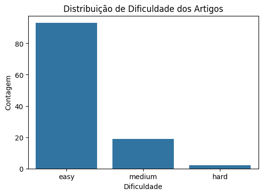
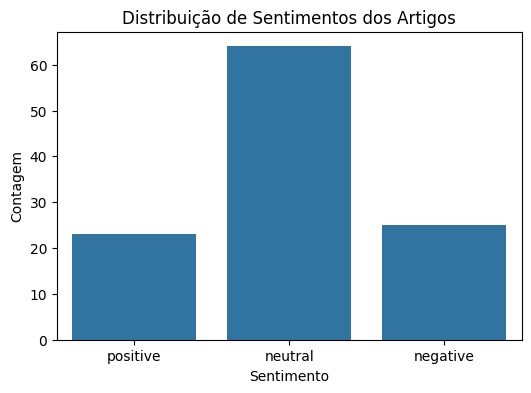
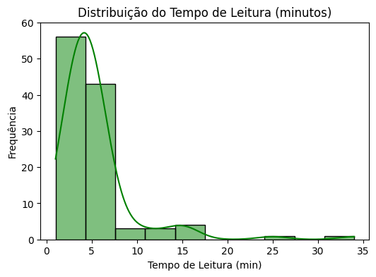
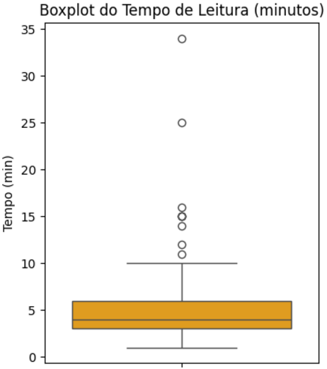
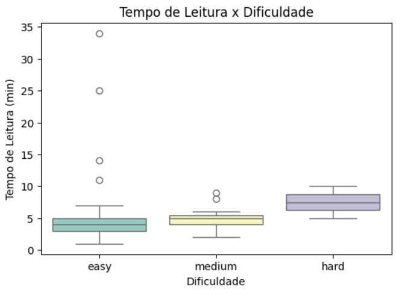
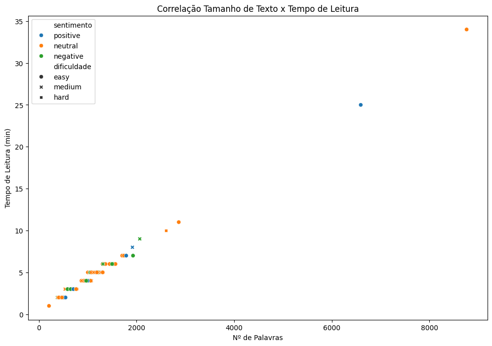
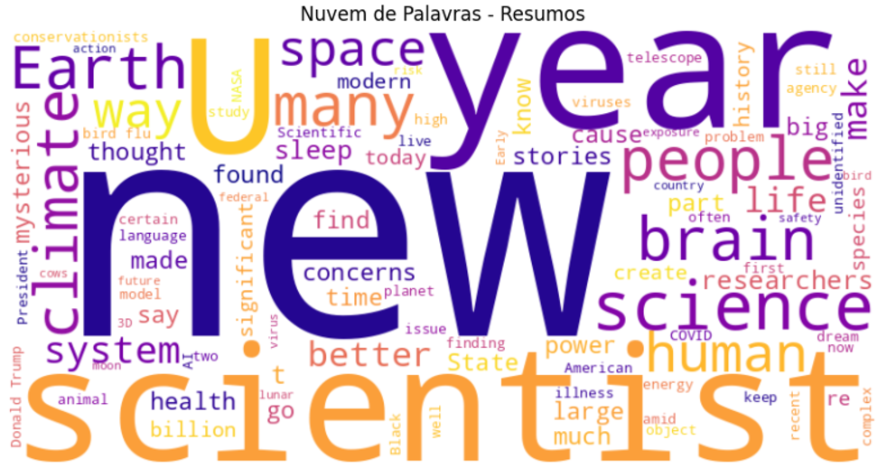

# Web Scraping e Análise de Dados das Últimas Postagens da Scientific American

**Aluna:** Emily Sato
**RA:** 770567

## 📚 Descrição do Projeto

Este projeto tem como objetivo **extrair** e **analisar** dados das diversas últimas postagens do site [Scientific American](https://www.scientificamerican.com/). Utilizando técnicas avançadas de web scraping, conseguimos coletar informações detalhadas sobre os artigos publicados recentemente, armazenando-os em formato JSON na pasta `data`. Posteriormente, realizamos uma análise aprofundada desses dados em um notebook Jupyter, gerando visualizações que destacam tendências, características e insights sobre o conteúdo divulgado pelo site.

## 🚀 Tecnologias e Ferramentas Utilizadas

- **Linguagem de Programação**: Python
- **Bibliotecas de Web Scraping**:
  - `requests`: Para realizar requisições HTTP e obter o conteúdo das páginas.
  - `BeautifulSoup` (`bs4`): Para parsear o HTML e extrair as informações desejadas.
- **Análise de Dados**:
  - `pandas`: Para manipulação e análise de dados estruturados.
  - `numpy`: Para operações numéricas e manipulação de arrays.
- **Visualização de Dados**:
  - `seaborn`: Para criação de gráficos estatísticos atraentes.
  - `matplotlib`: Para visualizações básicas e personalizadas.
  - `wordcloud`: Para gerar nuvens de palavras a partir dos resumos dos artigos.
- **Processamento de Texto**:
  - `re` (Expressões Regulares): Para limpeza e formatação dos textos extraídos.
- **Modelagem de Tópicos**:
  - `scikit-learn` (`CountVectorizer`, `LatentDirichletAllocation`): Para realizar análise de tópicos (LDA) nos textos completos dos artigos.
- **Ambiente de Desenvolvimento**:
  - Google Colab: Para integrar código, visualizações e análises em um único documento interativo.

## 🛠️ Metodologia

### 1. **Escolha do Site e Identificação da Estrutura HTML**
Selecionamos o site [Scientific American](https://www.scientificamerican.com/) devido à sua relevância e credibilidade histórica na divulgação científica. A primeira etapa envolveu analisar a estrutura HTML das páginas de últimas postagens para identificar os elementos que contêm as informações desejadas, como título, link, categoria, data, resumo e autores.

### 2. **Implementação do Web Scraping**
Desenvolvemos scripts em Python utilizando `requests` para obter o conteúdo das páginas e `BeautifulSoup` para parsear o HTML. O código foi estruturado para navegar por múltiplas páginas (até 15 páginas) e extrair dados de cada artigo listado.

```python
import requests
from bs4 import BeautifulSoup
import json
import re
import os

# Cabeçalho para simular um navegador
headers = {
    "User-Agent": "Mozilla/5.0 (Windows NT 10.0; Win64; x64) AppleWebKit/537.36 (KHTML, like Gecko) Chrome/117.0.0.0 Safari/537.36"
}

def extrair_info_artigo_lista(article):
    """Extrai informações básicas da lista de artigos."""
    try:
        title = article.find("h2", class_="articleTitle-mtY5p").get_text(strip=True)
        link = article.find("a", class_="articleLink-2OMNo")["href"]
        full_link = "https://www.scientificamerican.com" + link
        kicker = article.find("div", class_="kicker-EEaW-").get_text(strip=True)
        category, date = kicker.split("December")
        date = "December" + date
        summary = article.find("div", class_="dek-KweYs").get_text(strip=True)
        authors = article.find("p", class_="authors-NCGt1").get_text(strip=True)
        return {
            "title": title,
            "link": full_link,
            "category": category.strip(),
            "date": date.strip(),
            "summary": summary,
            "authors": authors
        }
    except:
        return None

# URL base da lista de artigos
base_url = "https://www.scientificamerican.com/latest/"

# Número de páginas que você quer coletar
num_pages = 15

# Cria a pasta "data" se ela não existir
output_dir = "data"
os.makedirs(output_dir, exist_ok=True)

post_count = 1  # Inicializa o contador de postagens (fora do loop)

for page in range(1, num_pages + 1):
    # Cria a URL da página
    url = base_url if page == 1 else f"{base_url}?page={page}"
    print(f"Extraindo dados da página {page}: {url}")
    response = requests.get(url, headers=headers)
    soup = BeautifulSoup(response.text, "html.parser")
    articles = soup.find_all("article", class_="article-pFLe7")
    
    for article in articles:
        info_lista = extrair_info_artigo_lista(article)
        if info_lista:
            # Aqui seria chamada a função para extrair informações detalhadas
            # e salvar os dados em JSON
            pass
```

### 3. **Extração de Informações Detalhadas**
Além das informações básicas, desenvolvemos funções para acessar cada artigo individualmente e extrair dados adicionais, como tempo de leitura, tipo do artigo, dificuldade, sentimento e o texto completo.

### 4. **Armazenamento dos Dados**
Os dados extraídos são salvos em arquivos JSON na pasta `data`, permitindo fácil acesso e manipulação futura.

### 5. **Análise de Dados**
Utilizamos `pandas` para organizar os dados em DataFrames, facilitando a análise estatística. Aplicamos visualizações com `seaborn` e `matplotlib` para identificar padrões e tendências. A modelagem de tópicos com LDA foi realizada para categorizar os artigos em diferentes temas.

## 🧩 Desafios Enfrentados

### 1. **Estrutura Variável das Páginas**
Uma das principais dificuldades foi lidar com a inconsistência na estrutura HTML das páginas e dos artigos individuais. Alguns elementos não estavam sempre presentes ou tinham classes dinâmicas, exigindo implementações com tratamentos de exceções.

### 2. **Decodificação de JSON Incorporado**
Muitos artigos incorporavam dados em scripts JSON dentro do HTML. Inicialmente, enfrentamos erros de decodificação devido a caracteres especiais e formatações inconsistentes. Foi necessário aplicar expressões regulares (`re`) para limpar e preparar os dados antes da conversão.

```python
import re

def limpar_json(data):
    # Remove quebras de linha e caracteres de controle
    data = re.sub(r'[\n\r\t]+', ' ', data)
    # Substitui aspas
    data = data.replace('\"', '"')
    return data
```

### 3. **Manutenção de Sessões e Limitação de Requisições**
Para evitar bloqueios por parte do servidor, implementamos pausas entre as requisições e utilizamos cabeçalhos personalizados para simular um navegador real. Contudo, a frequência das requisições ainda representou um desafio para a estabilidade do scraping.

### 4. **Processamento de Texto Extenso**
A extração e limpeza do texto completo dos artigos demandou atenção para remover elementos indesejados, como anúncios e links internos, garantindo que apenas o conteúdo relevante fosse analisado.

## 📊 Resultados e Análises

### 1. **Distribuição de Dificuldade dos Artigos**



- **Observação**: A maioria dos artigos está marcada como "easy", seguida por "medium" e poucos "hard".
- **Insight**: O conteúdo tende a ser mais acessível, possivelmente visando um público amplo.

### 2. **Distribuição de Sentimento dos Artigos**



- **Observação**: A categoria "neutral" predomina, seguida de "positive" e "negative".
- **Insight**: Artigos científicos geralmente mantêm uma perspectiva mais imparcial.

### 3. **Distribuição do Tempo de Leitura (minutos)**

  


- **Observação**: Grande concentração entre 2 e 6 minutos de leitura, com alguns outliers.
- **Insight**: Conteúdos curtos são preferidos para engajamento rápido, enquanto textos mais longos atendem a leitores mais dedicados.

### 4. **Tempo de Leitura x Dificuldade**



- **Observação**: Artigos "easy" têm tempo de leitura medianamente mais curto, mas há exceções.
- **Insight**: A dificuldade não está necessariamente ligada ao comprimento do texto, sugerindo clareza na escrita.

### 5. **Distribuição do Tamanho do Texto (número de palavras)**


- **Observação**: A maioria dos artigos tem entre 500 e 2.000 palavras, com alguns muito extensos.
- **Insight**: Textos moderados são predominantes, equilibrando profundidade e acessibilidade.

### 6. **Correlação entre Tamanho do Texto e Tempo de Leitura**



- **Observação**: Relação quase linear entre o número de palavras e o tempo de leitura.
- **Insight**: Validação da consistência dos dados, onde textos mais longos demandam mais tempo para leitura.

### 7. **Nuvem de Palavras dos Resumos**



- **Observação**: Termos como "science", "climate", "system", "Earth" são predominantes.
- **Insight**: Os artigos abordam amplamente temas científicos e de relevância global.

### 8. **Modelagem de Tópicos (LDA)**

#### Tópico 1
```
science like people new health really know just said time virus think public animals papp
```
- **Interpretação**: Foco em **saúde**, **epidemiologia** e impacto da ciência na sociedade.

#### Tópico 2
```
says like people sleep brain just study time research years ai researchers new university human
```
- **Interpretação**: Enfatiza **neurociência** e **inteligência artificial**, explorando comportamento humano e tecnologias emergentes.

#### Tópico 3
```
says earth planet scientists years like stars life space new star way care people study
```
- **Interpretação**: Direcionado a **astronomia** e **astrobiologia**, incluindo temas de exploração espacial e preservação ambiental.

## 📝 Conclusão e Insights

1. **Nível de Escrita e Extensão**:
   - Predominância de artigos com dificuldade "easy" e tempo de leitura entre 2 e 6 minutos, indicando uma abordagem acessível e voltada para um público amplo.
   - Presença de artigos mais longos e "hard" sugere diversidade no conteúdo, atendendo também a leitores mais dedicados.

2. **Sentimento**:
   - A maioria dos artigos apresenta um sentimento "neutral", alinhado com a natureza científica e informativa da publicação.
   - Artigos "positive" e "negative" fornecem perspectivas balanceadas, enriquecendo a análise com diferentes tonalidades.

3. **Tópicos Dominantes**:
   - **Saúde e Epidemiologia**: Reflete a importância de temas relacionados à saúde pública e doenças infecciosas.
   - **Neurociência e Inteligência Artificial**: Indica um interesse crescente em tecnologias e suas interseções com o comportamento humano.
   - **Astronomia e Preservação Ambiental**: Destaca a relevância de questões planetárias e exploração espacial.

4. **Relação Tamanho x Tempo de Leitura**:
   - A correlação quase linear confirma a consistência dos dados, em que textos mais extensos naturalmente demandam mais tempo de leitura.

5. **Palavras-Chave Frequentes**:
   - Termos como "science", "Earth", "climate", "space" indicam os principais focos temáticos dos artigos, alinhando-se com as tendências atuais de pesquisa e divulgação científica.

6. **Desafios Superados**:
   - A adaptação às estruturas variáveis das páginas e a limpeza eficaz dos dados JSON incorporados foram importantes para garantir a integridade e a precisão dos dados coletados.
   - A implementação de técnicas de scraping e processamento de texto assegurou uma coleta eficiente, apesar das barreiras técnicas enfrentadas.

7. **Aplicações Práticas**:
   - **Decisões Estratégicas**: As análises fornecem uma base sólida para entender quais temas e formatos repercutem mais entre o público, auxiliando na criação de conteúdo futuro.
   - **Melhoria de Conteúdo**: Identificar a predominância de conteúdos "easy" pode orientar a diversificação de níveis de dificuldade para atender a diferentes segmentos de leitores.
   - **Engajamento de Leitores**: Compreender a distribuição de tempo de leitura e tamanho dos textos ajuda a otimizar o engajamento, balanceando entre conteúdos rápidos e aprofundados.


